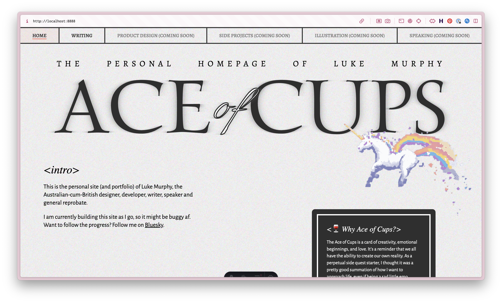
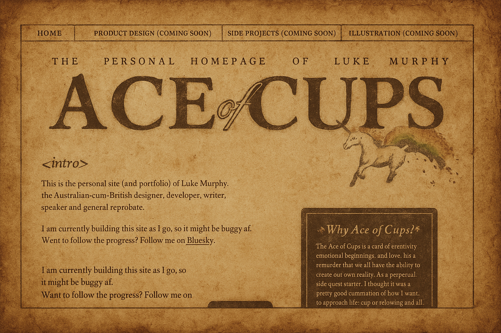
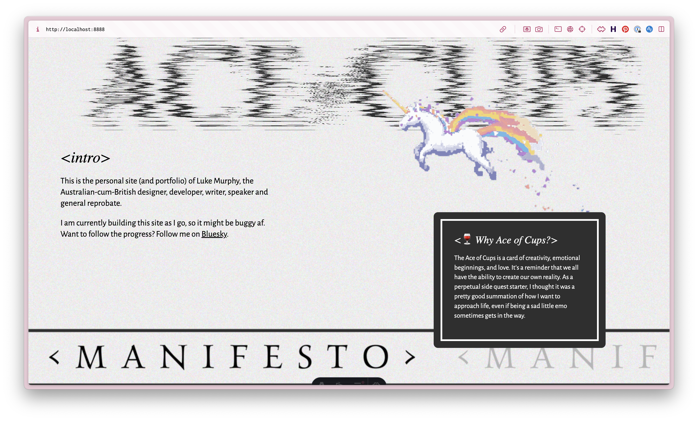

Oh hey, look, it’s a new website. I started tinkering with a new home for my thoughts last December, and even got the bare bones of a website started. Then, of course, it ended up on the shelf like every other forlorn side project. It was only after [WDC](https://www.webdevconf.com/) this year, and specifically diving deep in to [Henry Desroches](https://www.henry.codes/)’ personal projects, that I decided to wipe the dust off it, throw it in the bin, and start anew.

I’m really proud of the fact that I got something working and online within the space of a week. It’s completely incomplete, possibly (probably) broken, and needs to get more unhinged (and more serious in parts), but it’s alive. 

## Committing to continuous improvement

On the website, the one thing I’m committing to myself is that I do at least one update every two weeks. It might be fixing something, adding something, or tinkering with something, but I want it to be a constant, iterative process. I’m also committing myself to not giving a shit about changing things as my whims take me. A personal website isn’t a place to be consistent. In fact, this website will be as consistent as my personality.

In saying that, I have *a lot* of content to actually get live, so I don’t think it’ll be hard to keep adding for the next year. The next step is to get a changelog live so I can have what I do be more visible…

## Thinking about website patina

It’s not the first time I’ve been thinking about how websites age… 

One of my favourite things about physical books is the way they build character over time. The slight change in colour. The scuffs at the edge of covers. The shape and bend of the book (proud spine cracker, fight me). All signs of an object that has been used, appreciated, and loved over time. 

When it comes to metal, stone, wood or leather, this is referred to as ‘[patina](https://en.wikipedia.org/wiki/Patina)’, talking about the change in the surface of materials as they age and change. 

What is the equivalent of patina in the [digital space](https://markboulton.co.uk/journal/digital-patina/)? Aside from broken links and out of date content, what else do we have to signify the passage of time and use? It’s not quite the same, but it’s why I like when conference sites include all of their previous event sites as an archive, so you can look through and see the evolution. I’m wondering if more services and products should provide a kind of self-wayback machine? The only problem I see is that historical rewrites could be extremely easy. At least the wayback machine is agnostic and third-party…

I remember thinking about this and wondering if there was a way to artificially reproduce patina based off of stats and age? A slight yellowing of the whites… Rounding off the edges of anything sharp… Adding the slightest of blurs to everything… It’s completely fake, of course, which is kind of missing the point of patina… But still, a project for the shelf.

## Thinking about decision making

On a completely different note, I had the pleasure of attending [Leading Design](https://leadingdesign.com/conferences/london-2025) in London this week, and there was one particular statement that was said that has really stuck with me. [TB, from Adobe Design](https://www.linkedin.com/in/bardlavens/), talked about how decisions should be made by those closest to the problems. That is, as leaders, we should be enabling way more decision making down the chain, to the people who not only have the most exposure to these areas, but are also likely the most impacted by decisions.

It was putting voice to a problem I’ve seen play out in multiple orgs… And as a solution, this makes so much sense. How do you actually get it to happen though? I would even go one step further and say that you should be aiming for strategy to be bottom up rather than top down. There have been too many times where I’ve seen companies being led down the wrong strategic path, purely because a leader isn’t close enough to the actual users and problems they face. Sure, it’s our job as ICs and folks further down the chain to feed that information up, but I’m coming to learn that second-hand information is only so useful. There’s nothing quite like experiencing the pain yourself, or seeing the pain be experienced first-hand, that can really drive decision making and strategic direction. 

But how do we build that level of trust to enable and allow this? 

## The website tinkering zone

One of the latest things I put in place on the website were some gnarly svg filters lifted directly from [Henry’s blog post](https://henry.codes/writing/how-to-distort-text-with-svg/). The main difference I did was play with the scale and frequency, and then hook that up to both a randomiser, to get the glitch, and a scroll trigger, to make it unravel on scroll. Quite happy with the effect, but who knows, I might get bored of it next week and delete it.